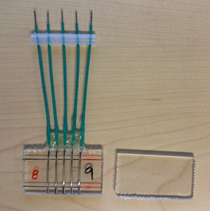
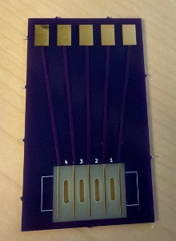
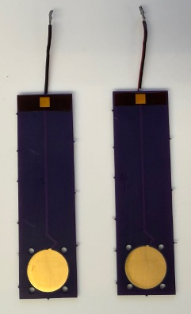

# Conductivity Cell Fabrication

Fabrication resources for ionic conductivity cells, covering both manual (by-hand) construction and PCB-based fabrication.

| In-plane cell (hand) | In-plane cell (PCB) | Through-plane cell (PCB) |
|---|---|---|
|  |  |  |

## Contents

- `manuals/Fabrication_Manual_for_In_Plane_Ionic_Conductivity_Cell.pdf` — step-by-step manual for fabricating in-plane ionic conductivity cells by hand.
- `manuals/KiCad_for_Conductivity_Cell_Design.pdf` — manual for designing and fabricating conductivity cells as PCBs using KiCad.
- `pcb_designs/TP_cell/` — KiCad project and gerber files for the through-plane (TP) cell design.
- `pcb_designs/IP_cell_long-holes/` — KiCad project and gerber files for the in-plane (IP), long-holes cell design.

## PCB designs

Each folder under `pcb_designs/` contains the full KiCad project (`.kicad_pro`, `.kicad_pcb`, `.kicad_sch`) plus a `gerber`/`gerbers` folder with manufacturing files ready to submit to a PCB fab.
